# 🌦️ Automated Weather Report Email System (Python Project)

## 📘 Project Overview

This project automates the **daily weather data extraction, analysis, and report delivery via email** using Python.
It uses the **OpenWeatherMap API** to fetch live weather data for multiple cities, stores it in a structured format, and automatically emails a daily weather summary report to predefined recipients.

---

## 🎯 Key Objectives

* Automate **real-time weather data collection**
* Analyze and structure data with **Pandas**
* **Store** reports locally or in a MySQL database
* Automatically **send weather reports** via email
* Schedule the process to run **daily**

---

## ⚙️ Technologies Used

| Category                | Tools / Libraries              |
| ----------------------- | ------------------------------ |
| 🌐 API Integration      | `requests`, `json`             |
| 🧮 Data Processing      | `pandas`, `datetime`           |
| 📧 Email Service        | `smtplib`, `email`, `MIMEBase` |
| ⚙️ Automation           | `schedule`, `time`             |
| 🔑 Security             | `python-dotenv`                |
| 🗄️  Database            | `sqlalchemy`, `pymysql`        |

---

## 🔑 Environment Setup

### 1️⃣ Install Dependencies

```bash
pip install requests pandas python-dotenv schedule sqlalchemy pymysql
```

### 2️⃣ Set Up `.env` File

Create a `.env` file in your project directory and add:

```env
OPENWEATHER_API_KEY=your_api_key_here
SENDER_EMAIL=youremail@gmail.com
APP_PASSWORD=your_app_password
RECEIVER_EMAIL=manager@example.com
DB_USER=root
DB_PASS=your_password
DB_HOST=localhost
DB_NAME=weather_db
```

> ⚠️ If using Gmail, generate an **App Password** instead of your normal password.

---

## 🧠 How It Works

```mermaid
flowchart TD
A[Start Script] --> B[Load Environment Variables]
B --> C[Fetch Weather Data OpenWeather API]
C --> D[Transform JSON → Pandas DataFrame]
D --> E[Save CSV/Database]
E --> F[Email Daily Report]
F --> G[Schedule Next Execution]
```



---

## 💻 Full Python Program

```python
# ===============================================
# 🌦️ Automated Weather Report Email System
# ===============================================

import requests
import pandas as pd
from datetime import datetime
import smtplib
from email.message import EmailMessage
import os
import time
import schedule
from dotenv import load_dotenv

# --------------------------------------------------
# 1️⃣ Load environment variables
# --------------------------------------------------
load_dotenv()

API_KEY = os.getenv("OPENWEATHER_API_KEY")
SENDER_EMAIL = os.getenv("SENDER_EMAIL")
RECEIVER_EMAIL = os.getenv("RECEIVER_EMAIL")
APP_PASSWORD = os.getenv("APP_PASSWORD")

CITIES = ["Chennai", "Delhi", "Mumbai", "Bengaluru", "Hyderabad", "Kolkata"]

# --------------------------------------------------
# 2️⃣ Fetch weather data from OpenWeatherMap API
# --------------------------------------------------
def fetch_weather(city):
    try:
        url = f"http://api.openweathermap.org/data/2.5/weather?q={city}&appid={API_KEY}&units=metric"
        response = requests.get(url)
        data = response.json()

        record = {
            "city": city,
            "temperature (°C)": data["main"]["temp"],
            "humidity (%)": data["main"]["humidity"],
            "pressure (hPa)": data["main"]["pressure"],
            "weather": data["weather"][0]["description"].title(),
            "wind_speed (m/s)": data["wind"]["speed"],
            "date_time": datetime.now().strftime("%Y-%m-%d %H:%M:%S")
        }
        return record

    except Exception as e:
        print(f"❌ Error fetching data for {city}: {e}")
        return None

# --------------------------------------------------
# 3️⃣ Process and save the data
# --------------------------------------------------
def process_and_save():
    all_data = []
    for city in CITIES:
        print(f"Fetching weather for: {city}...")
        record = fetch_weather(city)
        if record:
            all_data.append(record)
        time.sleep(1)  # avoid API rate limits

    if not all_data:
        print("⚠️ No data fetched.")
        return None

    df = pd.DataFrame(all_data)
    file_name = f"Weather_Report_{datetime.now().strftime('%Y%m%d_%H%M')}.csv"
    df.to_csv(file_name, index=False)
    print(f"✅ Weather report saved as {file_name}")
    return file_name

# --------------------------------------------------
# 4️⃣ Send the weather report via email
# --------------------------------------------------
def send_email_report(file_name):
    try:
        msg = EmailMessage()
        msg["Subject"] = "🌤️ Daily Weather Report"
        msg["From"] = SENDER_EMAIL
        msg["To"] = RECEIVER_EMAIL
        msg.set_content("Hello,\n\nPlease find attached today's automated weather report.\n\nRegards,\nWeather Automation Bot 🤖")

        with open(file_name, "rb") as f:
            msg.add_attachment(f.read(), maintype="application", subtype="octet-stream", filename=file_name)

        with smtplib.SMTP_SSL("smtp.gmail.com", 465) as smtp:
            smtp.login(SENDER_EMAIL, APP_PASSWORD)
            smtp.send_message(msg)

        print(f"📧 Email sent successfully to {RECEIVER_EMAIL}")

    except Exception as e:
        print(f"❌ Failed to send email: {e}")

# --------------------------------------------------
# 5️⃣ Combined workflow
# --------------------------------------------------
def job():
    print("\n🚀 Starting daily weather automation...")
    file_name = process_and_save()
    if file_name:
        send_email_report(file_name)
    print("✅ Task completed successfully.\n")

# --------------------------------------------------
# 6️⃣ Schedule automation
# --------------------------------------------------
schedule.every().day.at("08:00").do(job)

print("⏰ Scheduler started... waiting for the next run.")
while True:
    schedule.run_pending()
    time.sleep(60)
```

---

## 📊 Example Output

| City    | Temperature (°C) | Humidity (%) | Pressure (hPa) | Weather   | Wind Speed (m/s) | Date Time        |
| ------- | ---------------- | ------------ | -------------- | --------- | ---------------- | ---------------- |
| Chennai | 31.2             | 70           | 1010           | Cloudy    | 3.2              | 2025-10-28 08:00 |
| Delhi   | 28.5             | 55           | 1007           | Clear Sky | 1.8              | 2025-10-28 08:00 |

---

## 📧 Example Email Output

**Subject:** 🌦️ Daily Weather Report
**Body:**

```
Hello,

Please find attached today's automated weather report.

Regards,
Weather Automation Bot 🤖
```

📎 **Attachment:** `Weather_Report_2025-10-28_0800.csv`

---


